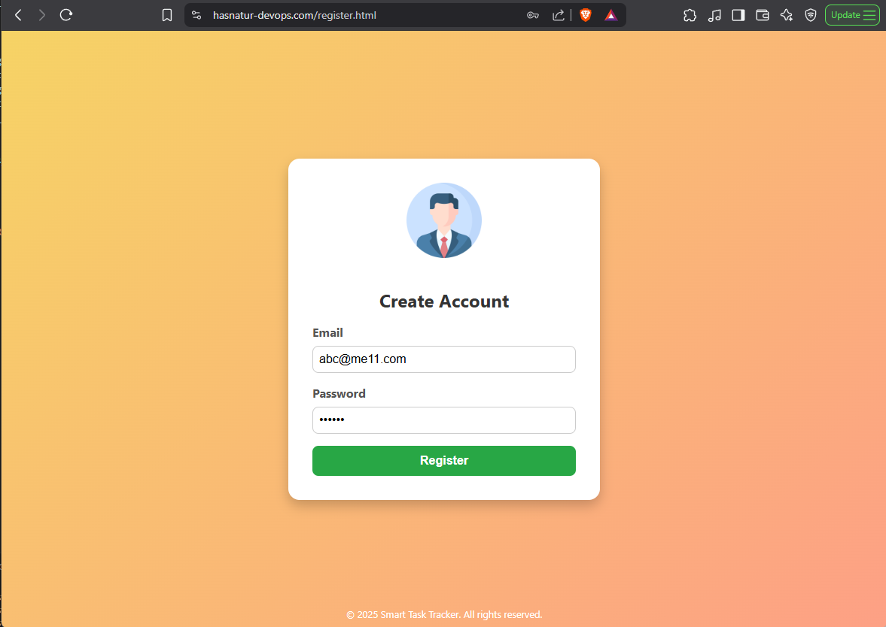
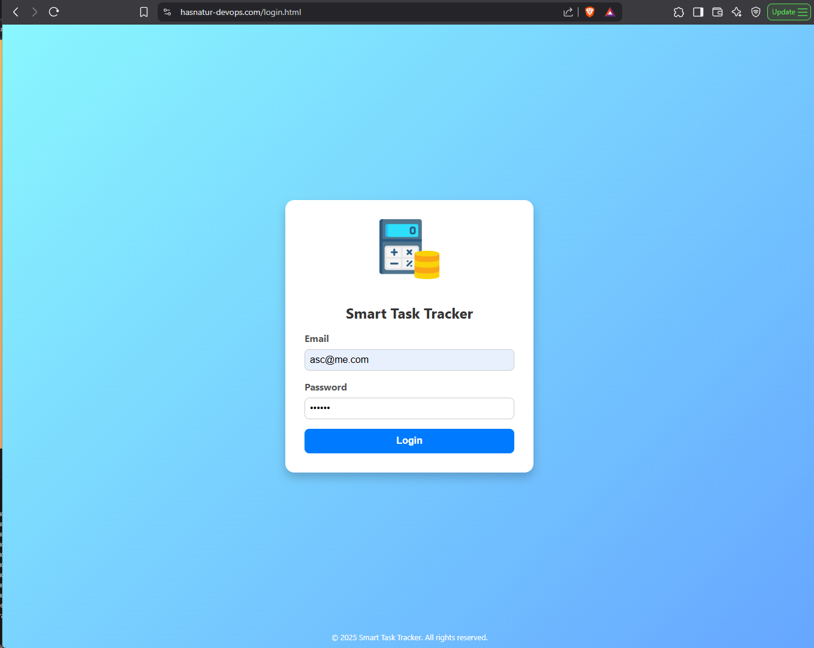
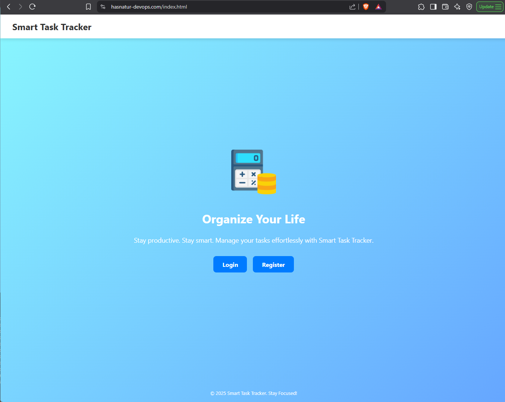

# 🌐 SmartTaskTracker – 3-Tier AWS Infrastructure

This project sets up a fully containerized **3-tier web application** deployed on **AWS** using **Terraform**.

The app allows users to **register**, **log in**, and manage tasks — backed by **PostgreSQL on Amazon RDS**, exposed through an **ECS Fargate backend API**, with a static **HTML frontend hosted on S3** and accessed via a custom domain secured with **HTTPS** via ALB + ACM.

---

## 🧱 Architecture Overview

- ✅ **Frontend**: Static HTML/JS hosted on **Amazon S3** with public read access
- ✅ **Backend**: Node.js Express API container deployed to **AWS ECS (Fargate)**
- ✅ **Database**: **PostgreSQL** on **Amazon RDS**
- ✅ **HTTPS**: Issued with **ACM** and served through an **Application Load Balancer**
- ✅ **Domain**: Custom domain (`hasnatur-devops.com`) managed in **Route 53**
- ✅ **IaC**: Managed with **Terraform** and modularized infrastructure

---

## 👤 User Authentication

Users must first **create an account** by registering with a **valid email address and password**.

### 🔐 Register

- Visit `/register.html`
- Fill out the form with email and password
- Upon successful registration, the user can proceed to log in

### 🔑 Login

- Visit `/login.html`
- Provide registered credentials
- Authenticated users are granted access to task management functionality

The backend uses **JWT (JSON Web Tokens)** for session handling and **bcrypt** for securely hashing passwords.

---

## 📁 Repo Structure

```bash
.
├── backend/              # Node.js Express API
│   ├── server.js
│   └── routes/
├── public/               # Static frontend (HTML, JS, CSS)
├── modules/              # Terraform modules
│   ├── vpc/
│   ├── alb/
│   ├── ecs/
│   ├── rds/
│   ├── s3/
│   └── https/
├── main.tf               # Root Terraform entry
├── variables.tf
└── README.md
```

## 🖼 Screenshots
### 🔐 Register Page



### 🔐 Login Page



### 📋 Dashboard




# 🧪 Troubleshooting
DNS_PROBE_POSSIBLE: Ensure Route53 alias record points to ALB.

CannotPullContainerError: Double-check the ECR image URI.

Email already exists: Clear your PostgreSQL table or inspect users table.

AccessDenied on S3: Ensure public ACLs are disabled and bucket policy is correct.

ACM Certificate hangs: DNS validation record may be missing or not propagated.

# 🧑‍💻 Author
Built by Hasnat for full-stack DevOps learning and deployment practice.

📜 License
MIT © 2025 Hasnat

```yaml
Let me know if you’d like to auto-generate badges, add screenshots, or include a deployment diagram!
```
